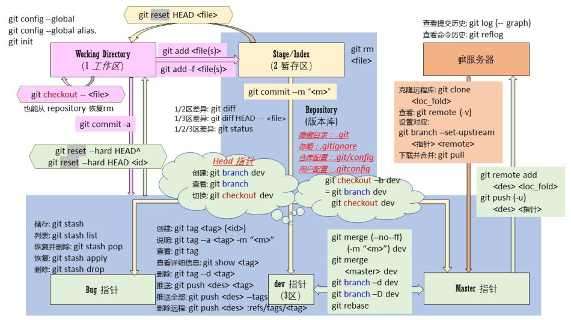
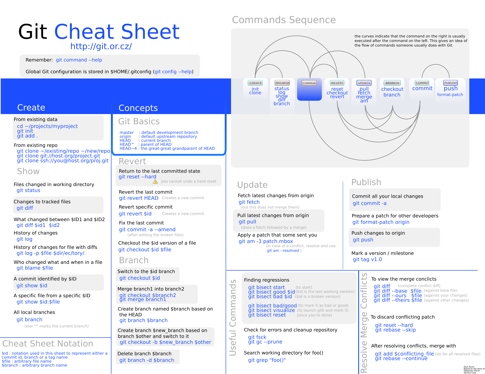
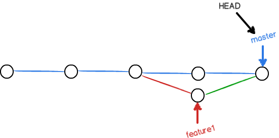

# Git常用命令 #

# 索引 #

<table>

<tr>
<td>标题</td>
<td>涉及命令</td>
<td>示例</td>
</tr>

<tr>
<td><a href='#Git简介'>Git简介</a></td>
<td></td>
<td></td>
</tr>

<tr>
<td><a href='#Git安装'>Git安装</a></td>
<td></td>
<td></td>
</tr>

<tr>
<td rowspan='3'><a href='#创建版本库'>创建版本库</a></td>
<td>git init
</td>
<td>
</td>
</tr>

<tr>
<td>git add</td>
<td>git add file2.txt file3.txt</td>
</tr>

<tr>
<td>git commit</td>
<td>git commit -m "add 3 files."</td>
</tr>

<tr>
<td rowspan='3'><a href='#版本回退'>版本回退</a></td>
<td>
git reset
</td>
<td>
git reset --hard HEAD^ 
git reset --hard 3628164
</td>
</tr>

<tr>
<td>git log</td>
<td>git log --pretty=oneline</td>
</tr>

<tr>
<td>git reflog</td>
<td></td>
</tr>

<tr>
<td><a href='#工作区和暂存区'>工作区和暂存区</a></td>
<td>git status</td>
<td></td>
</tr>

<tr>
<td><a href='#管理修改'>管理修改</a></td>
<td>
git diff
</td>
<td>
git diff HEAD -- readme.txt 
</td>
</tr>

<tr>
<td><a href='#撤销修改'>撤销修改</a></td>
<td>
git checkout 
</td>
<td>
git checkout -- readme.txt 
</td>
</tr>

<tr>
<td><a href='#删除文件'>删除文件</a></td>
<td>git rm</td>
<td>git rm test.txt</td>
</tr>

<tr>
<td><a href='#远程仓库'>远程仓库</a></td>
<td>ssh-keygen</td>
<td>ssh-keygen -t rsa -C "youremail@example.com"</td>
</tr>

<tr>
<td rowspan='2'><a href='#添加远程库'>添加远程库</a></td>
<td>git remote</td>
<td>git remote add origin git@github.com:michaelliao/learngit.git</td>
</tr>

<tr>
<td>git push</td>
<td>git push -u origin master</td>
</tr>

<tr>
<td><a href='#从远程库克隆'>从远程库克隆</a></td>
<td>git clone</td>
<td>git clone git@github.com:michaelliao/gitskills.git</td>
</tr>

<tr>
<td><a href='#分支管理'>分支管理</a></td>
<td></td>
<td></td>
</tr>

<tr>
<td rowspan='6'><a href='#创建与合并分支'>创建与合并分支</a></td>
<td rowspan='3'>
git branch
</td>
<td>
git branch 
查看分支
</td>
</tr>

<tr>
<td>
git branch (name) 
创建分支
</td>
</tr>

<tr>
<td>
git branch -d (name) 
删除分支
</td>
</tr>

<tr>
<td rowspan='2'>git checkout</td>
<td>git checkout (name) 
切换分支</td>
</tr>

<tr>
<td>git checkout -b (name) 
创建+切换分支
</td>
</tr>

<tr>
<td>git merge</td>
<td>git merge (name) 
合并某分支到当前分支
</td>
</tr>

<tr>
<td><a href='#解决冲突'>解决冲突</a></td>
<td></td>
<td></td>
</tr>

<tr>
<td><a href='#分支管理策略'>分支管理策略</a></td>
<td></td>
<td></td>
</tr>

<tr>
<td rowspan='6'><a href='#Bug分支'>Bug分支</a></td>
<td rowspan='6'>git stash</td>
<td>git stash 
储藏工作现场</td>
</tr>

<tr>
<td>git stash apply 
恢复工作现场 
(stash内容并不删除)</td>
</tr>

<tr>
<td>git stash drop 
用于删除stash</td>
</tr>

<tr>
<td>
git stash pop 
(恢复的同时把stash内容也删了)
</td>
</tr>

<tr>
<td>git stash list 
查看stash</td>
</tr>

<tr>
<td>git stash apply stash@{0} 
恢复指定stash(在多stash多的情况下)</td>
</tr>

<tr>
<td><a href='#Feature分支'>Feature分支</a></td>
<td></td>
<td>git branch -D (name) 
强制删除</td>
</tr>

<tr>
<td rowspan='5'><a href='#多人协作'>多人协作</a></td>
<td rowspan='5'></td>
<td>
git remote -v 
查看远程库信息
</td>
</tr>

<tr>
<td>
git push origin branch-name 
从本地推送分支
</td>
</tr>

<tr>
<td>
git pull 
抓取远程的新提交
</td>
</tr>

<tr>
<td>
git checkout -b branch-name origin/branch-name 
在本地创建和远程分支对应的分支
</td>
</tr>

<tr>
<td>
git branch --set-upstream branch-name origin/branch-name 
建立本地分支和远程分支的关联
</td>
</tr>

<tr>
<td><a href='#分支管理'>分支管理</a></td>
<td></td>
<td></td>
</tr>

<tr>
<td rowspan='4'><a href='#创建标签'>创建标签</a></td>
<td rowspan='3'>git tag</td>
<td>git tag 
查看所有标签</td>
</tr>

<tr>
<td>git tag v1.0 
打一个新标签</td>
</tr>

<tr>
<td>git tag -a <tagname> -m "blablabla... 
可以指定标签信息</td>
</tr>

<tr>
<td>git show</td>
<td>git show (tagname) 
查看标签信息</td>
</tr>

<tr>
<td rowspan='4'><a href='#操作标签'>操作标签</a></td>
<td rowspan='4'></td>
<td>
git push origin (tagname) 
可以推送一个本地标签
</td>
</tr>

<tr>
<td>
git push origin --tags 
可以推送全部未推送过的本地标签
</td>
</tr>

<tr>
<td>
git tag -d (tagname) 
可以删除一个本地标签
</td>
</tr>

<tr>
<td>
git push origin :refs/tags/(tagname) 
可以删除一个远程标签
</td>
</tr>

<tr>
<td><a href='#使用Github'>使用Github</a></td>
<td></td>
<td></td>
</tr>

<tr>
<td><a href='#使用码云'>使用码云</a></td>
<td></td>
<td></td>
</tr>

<tr>
<td><a href='#自定义Git'>自定义Git</a></td>
<td></td>
<td></td>
</tr>

<tr>
<td><a href='#忽略特殊文件'>忽略特殊文件</a></td>
<td></td>
<td></td>
</tr>

<tr>
<td><a href='#配置别名'>配置别名</a></td>
<td></td>
<td></td>
</tr>

<tr>
<td><a href='#搭建git服务器'>搭建Git服务器</a></td>
<td></td>
<td></td>
</tr>

</table>

# Git简介 #

Git是目前世界上最先进的分布式版本控制系统（没有之一）。

# Git安装 #

[https://git-scm.com/downloads](https://git-scm.com/downloads)

安装完成后，还需要最后一步设置，在命令行输入：

	$ git config --global user.name "Your Name"
	$ git config --global user.email "email@example.com"

因为Git是分布式版本控制系统，所以，每个机器都必须自报家门：你的名字和Email地址。你也许会担心，如果有人故意冒充别人怎么办？这个不必担心，首先我们相信大家都是善良无知的群众，其次，真的有冒充的也是有办法可查的。

# 创建版本库 #

1.创建一个空目录

2.通过 **git init** 命令把这个目录变成Git可以管理的仓库

	$ git init
	Initialized empty Git repository in /Users/michael/learngit/.git/

Git就把仓库建好了，而且告诉你是一个空的仓库（empty Git repository）。

通过命令行**ls -ah**可以发现当前目录下多了一个.git的目录，这个目录是Git来跟踪管理版本库的。

没事千万不要手动修改这个目录里面的文件，不然改乱了，就把Git仓库给破坏了。

也不一定必须在空目录下创建Git仓库，选择一个已经有东西的目录也是可以的。

### 把文件添加到版本库 ###

首先这里再明确一下，所有的版本控制系统，其实只能跟踪**文本文件**的改动，比如TXT文件，网页，所有的程序代码等等，Git也不例外。版本控制系统可以告诉你每次的改动，比如在第5行加了一个单词“Linux”，在第8行删了一个单词“Windows”。

而图片、视频、Word这些二进制文件，虽然也能由版本控制系统管理，但没法跟踪文件的变化，只能把二进制文件每次改动串起来，也就是只知道图片从100KB改成了120KB，但到底改了啥，版本控制系统不知道，也没法知道。

**文本文件强烈建议使用标准的UTF-8编码，所有语言使用同一种编码，既没有冲突，又被所有平台所支持。**

**把一个文件放到Git仓库只需要两步。**

有文件**readme.txt**，内容如下：

	Git is a version control system.
	Git is free software.

1.用命令**git add**告诉Git，把文件添加到仓库：

	git add readme.txt

2.用命令**git commit**告诉Git，把文件提交到仓库：

	$ git commit -m "wrote a readme file"
	[master (root-commit) cb926e7] wrote a readme file
	 1 file changed, 2 insertions(+)
	 create mode 100644 readme.txt

简单解释一下**git commit**命令，**-m**后面输入的是本次提交的说明，可以输入任意内容，当然最好是有意义的，这样你就能从历史记录里方便地找到改动记录。

嫌麻烦不想输入**-m** "xxx"行不行？确实有办法可以这么干，**但是强烈不建议你这么干，因为输入说明对自己对别人阅读都很重要。**

为什么Git添加文件需要**add**，**commit**一共两步呢？因为**commit**可以一次提交很多文件，所以你可以多次**add**不同的文件，比如：

	$ git add file1.txt
	$ git add file2.txt file3.txt
	$ git commit -m "add 3 files."

# 版本回退 #

现在，readme.txt文件有多个版本：

版本1：wrote a readme file

	Git is a version control system.
	Git is free software.
版本2：add distributed

	Git is a distributed version control system.
	Git is free software.
版本3：append GPL

	Git is a distributed version control system.
	Git is free software distributed under the GPL.

用**git log**命令查看历史记录

	$ git log
	commit 3628164fb26d48395383f8f31179f24e0882e1e0
	Author: Michael Liao <askxuefeng@gmail.com>
	Date:   Tue Aug 20 15:11:49 2013 +0800
	
	    append GPL
	
	commit ea34578d5496d7dd233c827ed32a8cd576c5ee85
	Author: Michael Liao <askxuefeng@gmail.com>
	Date:   Tue Aug 20 14:53:12 2013 +0800
	
	    add distributed
	
	commit cb926e7ea50ad11b8f9e909c05226233bf755030
	Author: Michael Liao <askxuefeng@gmail.com>
	Date:   Mon Aug 19 17:51:55 2013 +0800
	
	    wrote a readme file

**git log**命令显示从最近到最远的提交日志。

如果嫌输出信息太多，看得眼花缭乱的，可以试试加上**--pretty=oneline**参数：

	$ git log --pretty=oneline
	3628164fb26d48395383f8f31179f24e0882e1e0 append GPL
	ea34578d5496d7dd233c827ed32a8cd576c5ee85 add distributed
	cb926e7ea50ad11b8f9e909c05226233bf755030 wrote a readme file

一大串类似3628164...882e1e0的是**commit id**（版本号）

### 准备把readme.txt回退到上一个版本 ###

首先，Git必须知道当前版本是哪个版本，在Git中，用**HEAD**表示当前版本，也就是最新的提交**3628164...882e1e0**，上一个版本就是**HEAD^**，上上一个版本就是**HEAD^^**，当然往上100个版本写100个^比较容易数不过来，所以写成**HEAD~100**。

现在，我们要把当前版本“append GPL”回退到上一个版本“add distributed”，就可以使用**git reset**命令：

	$ git reset --hard HEAD^
	HEAD is now at ea34578 add distributed

TODO:--hard具体用途

看看readme.txt的内容是不是版本add distributed：

	$ cat readme.txt
	Git is a distributed version control system.
	Git is free software.

果然。

还可以继续回退到上一个版本*wrote a readme file*，不过且慢，然我们用**git log**再看看现在版本库的状态：

	$ git log
	commit ea34578d5496d7dd233c827ed32a8cd576c5ee85
	Author: Michael Liao <askxuefeng@gmail.com>
	Date:   Tue Aug 20 14:53:12 2013 +0800
	
	    add distributed
	
	commit cb926e7ea50ad11b8f9e909c05226233bf755030
	Author: Michael Liao <askxuefeng@gmail.com>
	Date:   Mon Aug 19 17:51:55 2013 +0800
	
	    wrote a readme file

那个版本**append GPL**消失了

只要上面的命令行窗口还没有被关掉，就可以顺着往上找啊找啊，找到那个append GPL的**commit id**是3628164...，于是就可以指定回到未来的某个版本：

	$ git reset --hard 3628164
	HEAD is now at 3628164 append GPL

版本号没必要写全，前几位就可以了，Git会自动去找。当然也不能只写前一两位，因为Git可能会找到多个版本号，就无法确定是哪一个了。

Git的版本回退速度非常快，因为Git在内部有个指向当前版本的HEAD指针，当你回退版本的时候，Git仅仅是把HEAD从指向append GPL：

改为指向add distributed：

然后顺便把工作区的文件更新了。所以你让HEAD指向哪个版本号，你就把当前版本定位在哪。

**现在，你回退到了某个版本，关掉了电脑，第二天早上就后悔了，想恢复到新版本怎么办？找不到新版本的commit id怎么办？**

**在Git中，总是有后悔药可以吃的。**

当你用**$ git reset --hard HEAD^**回退到add distributed版本时，再想恢复到append GPL，就必须找到append GPL的commit id。Git提供了一个命令 **git reflog** 用来 **记录你的每一次命令**：

	$ git reflog
	ea34578 HEAD@{0}: reset: moving to HEAD^
	3628164 HEAD@{1}: commit: append GPL
	ea34578 HEAD@{2}: commit: add distributed
	cb926e7 HEAD@{3}: commit (initial): wrote a readme file

终于舒了口气，第二行显示append GPL的commit id是3628164，现在，你又可以乘坐时光机回到未来了。

# 工作区和暂存区 #

### 工作区（Working Directory） ###

就是你在电脑里能看到的目录，比如我的learngit文件夹就是一个工作区：

### 版本库（Repository） ###

工作区有一个隐藏目录**.git**，这个不算工作区，而是Git的版本库。

Git的版本库里存了很多东西，其中最重要的就是称为**stage**（或者叫**index**）的暂存区，还有Git为我们自动创建的第一个分支**master**，以及指向**master**的一个指针叫**HEAD**。

前面讲了我们把文件往Git版本库里添加的时候，是分两步执行的：

1.是用**git add**把文件添加进去，实际上就是把文件修改添加到暂存区；

2.是用**git commit**提交更改，实际上就是把暂存区的所有内容提交到当前分支。

因为我们创建Git版本库时，Git自动为我们创建了唯一一个master分支，所以，现在，git commit就是往master分支上提交更改。

**可以简单理解为，需要提交的文件修改通通放到暂存区，然后，一次性提交暂存区的所有修改。**

### 示例一 ###

对readme.txt做个修改，比如加上一行内容：

	Git is a distributed version control system.
	Git is free software distributed under the GPL.
	Git has a mutable index called stage.

然后，在工作区新增一个LICENSE文本文件（内容随便写）。

先用**git status**查看一下状态：

	$ git status
	
	# On branch master
	# Changes not staged for commit:
	#   (use "git add <file>..." to update what will be committed)
	#   (use "git checkout -- <file>..." to discard changes in working directory)
	#
	#       modified:   readme.txt
	#
	# Untracked files:
	#   (use "git add <file>..." to include in what will be committed)
	#
	#       LICENSE
	no changes added to commit (use "git add" and/or "git commit -a")

Git非常清楚地告诉我们，**readme.txt**被修改了，而**LICENSE**还从来没有被添加过，所以它的状态是Untracked。

### 示例二 ###

现在，使用两次命令**git add**，把readme.txt和LICENSE都添加后，用git status再查看一下：

	$ git status
	# On branch master
	# Changes to be committed:
	#   (use "git reset HEAD <file>..." to unstage)
	#
	#       new file:   LICENSE
	#       modified:   readme.txt

现在，暂存区的状态就变成这样了：

所以，**git add**命令实际上就是把要提交的所有修改放到暂存区（Stage），然后，执行**git commit**就可以一次性把暂存区的所有修改提交到分支。

	$ git commit -m "understand how stage works"
	[master 27c9860] understand how stage works
	 2 files changed, 675 insertions(+)
	 create mode 100644 LICENSE

一旦提交后，如果你又没有对工作区做任何修改，那么工作区就是“干净”的：

	$ git status
	# On branch master
	nothing to commit (working directory clean)

现在版本库变成了这样，暂存区就没有任何内容了：

# 管理修改 #

现在，假定你已经完全掌握了暂存区的概念。下面，我们要讨论的就是，**为什么Git比其他版本控制系统设计得优秀，因为Git跟踪并管理的是修改，而非文件。**

你会问，什么是修改？比如你新增了一行，这就是一个修改，删除了一行，也是一个修改，更改了某些字符，也是一个修改，删了一些又加了一些，也是一个修改，甚至创建一个新文件，也算一个修改。

为什么说Git管理的是修改，而不是文件呢？我们还是做实验。第一步，对readme.txt做一个修改，比如加一行内容：

	$ cat readme.txt
	Git is a distributed version control system.
	Git is free software distributed under the GPL.
	Git has a mutable index called stage.
	Git tracks changes.

然后，添加：

	$ git add readme.txt
	$ git status
	# On branch master
	# Changes to be committed:
	#   (use "git reset HEAD <file>..." to unstage)
	#
	#       modified:   readme.txt
	#

然后，再修改readme.txt：

	$ cat readme.txt 
	Git is a distributed version control system.
	Git is free software distributed under the GPL.
	Git has a mutable index called stage.
	Git tracks changes of files.
提交：

	$ git commit -m "git tracks changes"
	[master d4f25b6] git tracks changes
	 1 file changed, 1 insertion(+)

提交后，再看看状态：

	$ git status
	# On branch master
	# Changes not staged for commit:
	#   (use "git add <file>..." to update what will be committed)
	#   (use "git checkout -- <file>..." to discard changes in working directory)
	#
	#       modified:   readme.txt
	#
	no changes added to commit (use "git add" and/or "git commit -a")

怎么第二次的修改没有被提交？

回顾一下操作过程：

	第一次修改 -> git add -> 第二次修改 -> git commit

Git管理的是修改，当你用**git add**命令后，在工作区的第一次修改被放入暂存区，准备提交，

但是，在工作区的第二次修改并没有放入暂存区，所以，**git commit**只负责把暂存区的修改提交了，也就是第一次的修改被提交了，第二次的修改不会被提交。

提交后，用**git diff HEAD -- readme.txt**命令可以查看工作区和版本库里面最新版本的区别：

	$ git diff HEAD -- readme.txt 
	diff --git a/readme.txt b/readme.txt
	index 76d770f..a9c5755 100644
	--- a/readme.txt
	+++ b/readme.txt
	@@ -1,4 +1,4 @@
	 Git is a distributed version control system.
	
	 Git is free software distributed under the GPL.
	 Git has a mutable index called stage.
	-Git tracks changes.
	+Git tracks changes of files.

可见，第二次修改确实没有被提交。

那怎么提交第二次修改呢？你可以继续**git add**再**git commit**，也可以别着急提交第一次修改，先**git add**第二次修改，再**git commit**，就相当于把两次修改合并后一块提交了：

	第一次修改 -> git add -> 第二次修改 -> git add -> git commit

# 撤销修改 #

自然，你是不会犯错的。不过现在是凌晨两点，你正在赶一份工作报告，你在readme.txt中添加了一行：

	$ cat readme.txt
	Git is a distributed version control system.
	Git is free software distributed under the GPL.
	Git has a mutable index called stage.
	Git tracks changes of files.
	My stupid boss still prefers SVN.
在你准备提交前，一杯咖啡起了作用，你猛然发现了“stupid boss”可能会让你丢掉这个月的奖金！

既然错误发现得很及时，就可以很容易地纠正它。你可以删掉最后一行，手动把文件恢复到上一个版本的状态。如果用git status查看一下：

	$ git status
	# On branch master
	# Changes not staged for commit:
	#   (use "git add <file>..." to update what will be committed)
	#   (use "git checkout -- <file>..." to discard changes in working directory)
	#
	#       modified:   readme.txt
	#
	no changes added to commit (use "git add" and/or "git commit -a")
你可以发现，Git会告诉你，**git checkout -- file**可以丢弃工作区的修改：

	$ git checkout -- readme.txt
命令**git checkout -- readme.txt**意思就是，把readme.txt文件**在工作区的修改全部撤销**，这里有两种情况：

一种是readme.txt自修改后还没有被放到暂存区，现在，撤销修改就回到和版本库一模一样的状态；

一种是readme.txt已经添加到暂存区后，又作了修改，现在，撤销修改就回到添加到暂存区前的状态。

总之，就是让这个文件回到最近一次**git commit**或**git add**时的状态。

现在，看看readme.txt的文件内容：

	$ cat readme.txt
	Git is a distributed version control system.
	Git is free software distributed under the GPL.
	Git has a mutable index called stage.
	Git tracks changes of files.
文件内容果然复原了。

**git checkout -- file**命令中的 **--** 很重要，没有 **--**，就变成了“切换到另一个分支”的命令，

# 删除文件 #

在Git中，删除也是一个修改操作，我们实战一下，先添加一个新文件test.txt到Git并且提交：

	$ git add test.txt
	$ git commit -m "add test.txt"
	[master 94cdc44] add test.txt
	 1 file changed, 1 insertion(+)
	 create mode 100644 test.txt
一般情况下，你通常直接在文件管理器中把没用的文件删了，或者用rm命令删了：

	$ rm test.txt
这个时候，Git知道你删除了文件，因此，工作区和版本库就不一致了，**git status**命令会立刻告诉你哪些文件被删除了：

	$ git status
	# On branch master
	# Changes not staged for commit:
	#   (use "git add/rm <file>..." to update what will be committed)
	#   (use "git checkout -- <file>..." to discard changes in working directory)
	#
	#       deleted:    test.txt
	#
	no changes added to commit (use "git add" and/or "git commit -a")
现在你有两个选择，一是确实要从版本库中删除该文件，那就用命令**git rm**删掉，并且**git commit**：

	$ git rm test.txt
	rm 'test.txt'
	$ git commit -m "remove test.txt"
	[master d17efd8] remove test.txt
	 1 file changed, 1 deletion(-)
	 delete mode 100644 test.txt
现在，文件就从版本库中被删除了。

另一种情况是删错了，因为版本库里还有呢，所以可以很轻松地把误删的文件恢复到最新版本：

	$ git checkout -- test.txt
**git checkout其实是用版本库里的版本替换工作区的版本**，无论工作区是修改还是删除，都可以“**一键还原**”。

# 远程仓库 #

Git是分布式版本控制系统，同一个Git仓库，可以分布到不同的机器上。怎么分布呢？最早，肯定只有一台机器有一个原始版本库，此后，别的机器可以“克隆”这个原始版本库，而且每台机器的版本库其实都是一样的，并没有主次之分。

你肯定会想，至少需要两台机器才能玩远程库不是？但是我只有一台电脑，怎么玩？

其实一台电脑上也是可以克隆多个版本库的，只要不在同一个目录下。不过，现实生活中是不会有人这么傻的在一台电脑上搞几个远程库玩，因为一台电脑上搞几个远程库完全没有意义，而且硬盘挂了会导致所有库都挂掉，所以我也不告诉你在一台电脑上怎么克隆多个仓库。

实际情况往往是这样，找一台电脑充当服务器的角色，每天24小时开机，其他每个人都从这个“服务器”仓库克隆一份到自己的电脑上，并且各自把各自的提交推送到服务器仓库里，也从服务器仓库中拉取别人的提交。

完全可以自己搭建一台运行Git的服务器，不过现阶段，为了学Git先搭个服务器绝对是小题大作。好在这个世界上有个叫GitHub的神奇的网站，从名字就可以看出，这个网站就是提供Git仓库托管服务的，所以，只要注册一个GitHub账号，就可以免费获得Git远程仓库。

**由于你的本地Git仓库和GitHub仓库之间的传输是通过SSH加密的，所以，需要一点设置：**

**第1步**：创建SSH Key。在用户主目录下，看看有没有.ssh目录，如果有，再看看这个目录下有没有id_rsa和id_rsa.pub这两个文件，如果已经有了，可直接跳到下一步。如果没有，打开Shell（Windows下打开Git Bash），创建SSH Key：

	$ ssh-keygen -t rsa -C "youremail@example.com"

你需要把邮件地址换成你自己的邮件地址，然后一路回车，使用默认值即可，由于这个Key也不是用于军事目的，所以也无需设置密码。

如果一切顺利的话，可以在用户主目录里找到**.ssh**目录，里面有**id_rsa**和**id_rsa.pub**两个文件，这两个就是SSH Key的秘钥对，**id_rsa**是私钥，不能泄露出去，**id_rsa.pub**是公钥，可以放心地告诉任何人。

**第2步**：登陆GitHub，打开“Account settings”，“SSH Keys”页面：

然后，点“Add SSH Key”，填上任意Title，在Key文本框里粘贴**id_rsa.pub**文件的内容：

点“Add Key”，你就应该看到已经添加的Key：

### 为什么GitHub需要SSH Key呢？ ###

因为GitHub需要识别出你推送的提交确实是你推送的，而不是别人冒充的，而Git支持SSH协议，所以，GitHub只要知道了你的公钥，就可以确认只有你自己才能推送。

当然，GitHub允许你添加多个Key。假定你有若干电脑，你一会儿在公司提交，一会儿在家里提交，只要把每台电脑的Key都添加到GitHub，就可以在每台电脑上往GitHub推送了。

最后友情提示，在GitHub上免费托管的Git仓库，任何人都可以看到喔（但只有你自己才能改）。所以，不要把敏感信息放进去。

如果你不想让别人看到Git库，有两个办法:

一个是交点保护费，让GitHub把公开的仓库变成私有的，这样别人就看不见了（不可读更不可写）。

另一个办法是自己动手，搭一个Git服务器，因为是你自己的Git服务器，所以别人也是看不见的。

# 添加远程库 #

现在的情景是，你已经在本地创建了一个Git仓库后，又想在GitHub创建一个Git仓库，并且让这两个仓库进行远程同步，这样，GitHub上的仓库既可以作为备份，又可以让其他人通过该仓库来协作，真是一举多得。

首先，登陆GitHub，然后，在右上角找到“Create a new repo”按钮，创建一个新的仓库：

在Repository name填入learngit，其他保持默认设置，点击“Create repository”按钮，就成功地创建了一个新的Git仓库：

目前，在GitHub上的这个learngit仓库还是空的，GitHub告诉我们，可以从这个仓库克隆出新的仓库，也可以把一个已有的本地仓库与之关联，然后，把本地仓库的内容推送到GitHub仓库。

现在，我们根据GitHub的提示，在本地的learngit仓库下运行命令：

	$ git remote add origin git@github.com:michaelliao/learngit.git

请千万注意，把上面的michaelliao替换成你自己的GitHub账户名，否则，你在本地关联的就是我的远程库，关联没有问题，但是你以后推送是推不上去的，因为你的SSH Key公钥不在我的账户列表中。

添加后，远程库的名字就是origin，这是Git默认的叫法，也可以改成别的，但是origin这个名字一看就知道是远程库。

下一步，就可以把本地库的所有内容推送到远程库上：

	$ git push -u origin master
	Counting objects: 19, done.
	Delta compression using up to 4 threads.
	Compressing objects: 100% (19/19), done.
	Writing objects: 100% (19/19), 13.73 KiB, done.
	Total 23 (delta 6), reused 0 (delta 0)
	To git@github.com:michaelliao/learngit.git
	 * [new branch]      master -> master
	Branch master set up to track remote branch master from origin.

把本地库的内容推送到远程，用git push命令，实际上是把当前分支master推送到远程。

由于远程库是空的，我们第一次推送master分支时，加上了-u参数，Git不但会把本地的master分支内容推送的远程新的master分支，还会把本地的master分支和远程的master分支关联起来，在以后的推送或者拉取时就可以简化命令。

推送成功后，可以立刻在GitHub页面中看到远程库的内容已经和本地一模一样：

从现在起，只要本地作了提交，就可以通过命令：

	$ git push origin master
把本地master分支的最新修改推送至GitHub，现在，你就拥有了真正的分布式版本库！

SSH警告

当你第一次使用Git的clone或者push命令连接GitHub时，会得到一个警告：

	The authenticity of host 'github.com (xx.xx.xx.xx)' can't be established.
	RSA key fingerprint is xx.xx.xx.xx.xx.
	Are you sure you want to continue connecting (yes/no)?
这是因为Git使用SSH连接，而SSH连接在第一次验证GitHub服务器的Key时，需要你确认GitHub的Key的指纹信息是否真的来自GitHub的服务器，输入yes回车即可。

Git会输出一个警告，告诉你已经把GitHub的Key添加到本机的一个信任列表里了：

	Warning: Permanently added 'github.com' (RSA) to the list of known hosts.
这个警告只会出现一次，后面的操作就不会有任何警告了。

如果你实在担心有人冒充GitHub服务器，输入yes前可以对照[GitHub的RSA Key的指纹信息](https://help.github.com/articles/what-are-github-s-ssh-key-fingerprints/)是否与SSH连接给出的一致。

# 从远程库克隆 #

上次讲了先有本地库，后有远程库的时候，如何关联远程库。

现在，假设我们从零开发，那么最好的方式是先创建远程库，然后，从远程库克隆。

首先，登陆GitHub，创建一个新的仓库，名字叫gitskills：

我们勾选Initialize this repository with a README，这样GitHub会自动为我们创建一个README.md文件。创建完毕后，可以看到README.md文件：

现在，远程库已经准备好了，下一步是用命令git clone克隆一个本地库：

	$ git clone git@github.com:michaelliao/gitskills.git
	Cloning into 'gitskills'...
	remote: Counting objects: 3, done.
	remote: Total 3 (delta 0), reused 0 (delta 0)
	Receiving objects: 100% (3/3), done.
	
	$ cd gitskills
	$ ls
	README.md

注意把Git库的地址换成你自己的，然后进入gitskills目录看看，已经有README.md文件了。

如果有多个人协作开发，那么每个人各自从远程克隆一份就可以了。

你也许还注意到，GitHub给出的地址不止一个，还可以用https://github.com/michaelliao/gitskills.git这样的地址。实际上，Git支持多种协议，默认的git://使用ssh，但也可以使用https等其他协议。

使用https除了速度慢以外，还有个最大的麻烦是每次推送都必须输入口令，但是在某些只开放http端口的公司内部就无法使用ssh协议而只能用https。

# 分支管理 #

分支就是科幻电影里面的平行宇宙，当你正在电脑前努力学习Git的时候，另一个你正在另一个平行宇宙里努力学习SVN。

如果两个平行宇宙互不干扰，那对现在的你也没啥影响。不过，在某个时间点，两个平行宇宙合并了，结果，你既学会了Git又学会了SVN！

分支在实际中有什么用呢？假设你准备开发一个新功能，但是需要两周才能完成，第一周你写了50%的代码，如果立刻提交，由于代码还没写完，不完整的代码库会导致别人不能干活了。如果等代码全部写完再一次提交，又存在丢失每天进度的巨大风险。

现在有了分支，就不用怕了。你创建了一个属于你自己的分支，别人看不到，还继续在原来的分支上正常工作，而你在自己的分支上干活，想提交就提交，直到开发完毕后，再一次性合并到原来的分支上，这样，既安全，又不影响别人工作。

# 创建与合并分支 #

在版本回退里，你已经知道，每次提交，Git都把它们串成一条时间线，这条时间线就是一个分支。截止到目前，只有一条时间线，在Git里，这个分支叫主分支，即master分支。HEAD严格来说不是指向提交，而是指向master，master才是指向提交的，所以，HEAD指向的就是当前分支。

一开始的时候，master分支是一条线，Git用master指向最新的提交，再用HEAD指向master，就能确定当前分支，以及当前分支的提交点：

每次提交，master分支都会向前移动一步，这样，随着你不断提交，master分支的线也越来越长。

---

当我们创建新的分支，例如dev时，Git新建了一个指针叫dev，指向master相同的提交，再把HEAD指向dev，就表示当前分支在dev上：

你看，Git创建一个分支很快，因为除了增加一个dev指针，改改HEAD的指向，工作区的文件都没有任何变化！

---

不过，从现在开始，对工作区的修改和提交就是针对dev分支了，比如新提交一次后，dev指针往前移动一步，而master指针不变：

---

假如我们在dev上的工作完成了，就可以把dev合并到master上。Git怎么合并呢？最简单的方法，就是直接把master指向dev的当前提交，就完成了合并：

所以Git合并分支也很快！就改改指针，工作区内容也不变！

---

合并完分支后，甚至可以删除dev分支。删除dev分支就是把dev指针给删掉，删掉后，我们就剩下了一条master分支：

---

**现在实战**

首先，我们创建dev分支，然后切换到dev分支：

	$ git checkout -b dev
	Switched to a new branch 'dev'

**git checkout**命令加上-b参数表示创建并切换，相当于以下两条命令：

	$ git branch dev
	$ git checkout dev
	Switched to branch 'dev'

然后，用**git branch**命令查看当前分支：

	$ git branch
	* dev
	  master

**git branch**命令会列出所有分支，当前分支前面会标一个*号。

然后，我们就可以在dev分支上正常提交，比如对readme.txt做个修改，加上一行：

	Creating a new branch is quick.

然后提交：

	$ git add readme.txt 
	$ git commit -m "branch test"
	[dev fec145a] branch test
	 1 file changed, 1 insertion(+)

现在，dev分支的工作完成，我们就可以切换回master分支：

	$ git checkout master
	Switched to branch 'master'

切换回master分支后，再查看一个readme.txt文件，刚才添加的内容不见了！因为那个提交是在dev分支上，而master分支此刻的提交点并没有变：

现在，我们把dev分支的工作成果合并到master分支上：

	$ git merge dev
	Updating d17efd8..fec145a
	Fast-forward
	 readme.txt |    1 +
	 1 file changed, 1 insertion(+)

**git merge**命令用于合并指定分支到当前分支。合并后，再查看readme.txt的内容，就可以看到，和dev分支的最新提交是完全一样的。

注意到上面的Fast-forward信息，Git告诉我们，这次合并是“快进模式”，也就是直接把master指向dev的当前提交，所以合并速度非常快。

当然，也不是每次合并都能Fast-forward，我们后面会讲其他方式的合并。

合并完成后，就可以放心地删除dev分支了：

	$ git branch -d dev
	Deleted branch dev (was fec145a).

删除后，查看branch，就只剩下master分支了：

	$ git branch
	* master

因为创建、合并和删除分支非常快，所以Git鼓励你使用分支完成某个任务，合并后再删掉分支，这和直接在master分支上工作效果是一样的，但过程更安全。

# 解决冲突 #
人生不如意之事十之八九，合并分支往往也不是一帆风顺的。

准备新的feature1分支，继续我们的新分支开发：

	$ git checkout -b feature1
	Switched to a new branch 'feature1'

修改readme.txt最后一行，改为：

	Creating a new branch is quick AND simple.

在feature1分支上提交：

	$ git add readme.txt 
	$ git commit -m "AND simple"
	[feature1 75a857c] AND simple
	 1 file changed, 1 insertion(+), 1 deletion(-)

切换到master分支：

	$ git checkout master
	Switched to branch 'master'
	Your branch is ahead of 'origin/master' by 1 commit.

Git还会自动提示我们当前master分支比远程的master分支要超前1个提交。

在master分支上把readme.txt文件的最后一行改为：

	Creating a new branch is quick & simple.

提交：

	$ git add readme.txt 
	$ git commit -m "& simple"
	[master 400b400] & simple
	 1 file changed, 1 insertion(+), 1 deletion(-)

现在，master分支和feature1分支各自都分别有新的提交，变成了这样：

这种情况下，Git无法执行“快速合并”，只能试图把各自的修改合并起来，但这种合并就可能会有冲突，我们试试看：

	$ git merge feature1
	Auto-merging readme.txt
	CONFLICT (content): Merge conflict in readme.txt
	Automatic merge failed; fix conflicts and then commit the result.

果然冲突了！Git告诉我们，readme.txt文件存在冲突，必须手动解决冲突后再提交。git status也可以告诉我们冲突的文件：

	$ git status
	# On branch master
	# Your branch is ahead of 'origin/master' by 2 commits.
	#
	# Unmerged paths:
	#   (use "git add/rm <file>..." as appropriate to mark resolution)
	#
	#       both modified:      readme.txt
	#
	no changes added to commit (use "git add" and/or "git commit -a")

我们可以直接查看readme.txt的内容：

	Git is a distributed version control system.
	Git is free software distributed under the GPL.
	Git has a mutable index called stage.
	Git tracks changes of files.
	<<<<<<< HEAD
	Creating a new branch is quick & simple.
	=======
	Creating a new branch is quick AND simple.
	>>>>>>> feature1
	>
Git用<<<<<<<，=======，>>>>>>>标记出不同分支的内容，我们修改如下后保存：

	Creating a new branch is quick and simple.

再提交：

	$ git add readme.txt 
	$ git commit -m "conflict fixed"
	[master 59bc1cb] conflict fixed

现在，master分支和feature1分支变成了下图所示：

用带参数的git log也可以看到分支的合并情况：

	$ git log --graph --pretty=oneline --abbrev-commit
	*   59bc1cb conflict fixed
	|\
	| * 75a857c AND simple
	* | 400b400 & simple
	|/
	* fec145a branch test
	...

最后，删除feature1分支：

	$ git branch -d feature1
	Deleted branch feature1 (was 75a857c).

工作完成。

# 分支管理策略 #

通常，合并分支时，如果可能，**Git会用Fast forward模式，但这种模式下，删除分支后，会丢掉分支信息。**

**如果要强制禁用Fast forward模式，Git就会在merge时生成一个新的commit，这样，从分支历史上就可以看出分支信息。**

下面我们实战一下--no-ff方式的git merge：

首先，仍然创建并切换dev分支：

	$ git checkout -b dev
	Switched to a new branch 'dev'
修改readme.txt文件，并提交一个新的commit：

	$ git add readme.txt 
	$ git commit -m "add merge"
	[dev 6224937] add merge
	 1 file changed, 1 insertion(+)
现在，我们切换回master：

	$ git checkout master
	Switched to branch 'master'
准备合并dev分支，请注意--no-ff参数，表示禁用Fast forward：

	$ git merge --no-ff -m "merge with no-ff" dev
	Merge made by the 'recursive' strategy.
	 readme.txt |    1 +
	 1 file changed, 1 insertion(+)

因为本次合并要创建一个新的commit，所以加上-m参数，把commit描述写进去。

合并后，我们用git log看看分支历史：

	$ git log --graph --pretty=oneline --abbrev-commit
	*   7825a50 merge with no-ff
	|\
	| * 6224937 add merge
	|/
	*   59bc1cb conflict fixed
	...
可以看到，**不使用Fast forward模式**，merge后就像这样：

### 分支策略 ###

在实际开发中，我们应该按照几个基本原则进行分支管理：

首先，master分支应该是非常稳定的，也就是仅用来发布新版本，平时不能在上面干活；

那在哪干活呢？干活都在dev分支上，也就是说，dev分支是不稳定的，到某个时候，比如1.0版本发布时，再把dev分支合并到master上，在master分支发布1.0版本；

你和你的小伙伴们每个人都在dev分支上干活，每个人都有自己的分支，时不时地往dev分支上合并就可以了。

所以，团队合作的分支看起来就像这样：

软件开发中，bug就像家常便饭一样。有了bug就需要修复，在Git中，由于分支是如此的强大，所以，**每个bug都可以通过一个新的临时分支来修复，修复后，合并分支，然后将临时分支删除。**

当你接到一个修复一个代号101的bug的任务时，很自然地，你想创建一个分支issue-101来修复它，但是，等等，当前正在dev上进行的工作还没有提交：

	$ git status
	# On branch dev
	# Changes to be committed:
	#   (use "git reset HEAD <file>..." to unstage)
	#
	#       new file:   hello.py
	#
	# Changes not staged for commit:
	#   (use "git add <file>..." to update what will be committed)
	#   (use "git checkout -- <file>..." to discard changes in working directory)
	#
	#       modified:   readme.txt
	#

并不是你不想提交，而是工作只进行到一半，还没法提交，预计完成还需1天时间。但是，必须在两个小时内修复该bug，怎么办？

幸好，Git还提供了一个stash功能，可以把当前工作现场“储藏”起来，等以后恢复现场后继续工作：

	$ git stash
	Saved working directory and index state WIP on dev: 6224937 add merge
	HEAD is now at 6224937 add merge

现在，用git status查看工作区，就是干净的（除非有没有被Git管理的文件），因此可以放心地创建分支来修复bug。

首先确定要在哪个分支上修复bug，假定需要在master分支上修复，就从master创建临时分支：

	$ git checkout master
	Switched to branch 'master'
	Your branch is ahead of 'origin/master' by 6 commits.
	$ git checkout -b issue-101
	Switched to a new branch 'issue-101'

现在修复bug，需要把“Git is free software ...”改为“Git is a free software ...”，然后提交：

	$ git add readme.txt 
	$ git commit -m "fix bug 101"
	[issue-101 cc17032] fix bug 101
	 1 file changed, 1 insertion(+), 1 deletion(-)
修复完成后，切换到master分支，并完成合并，最后删除issue-101分支：

	$ git checkout master
	Switched to branch 'master'
	Your branch is ahead of 'origin/master' by 2 commits.
	$ git merge --no-ff -m "merged bug fix 101" issue-101
	Merge made by the 'recursive' strategy.
	 readme.txt |    2 +-
	 1 file changed, 1 insertion(+), 1 deletion(-)
	$ git branch -d issue-101
	Deleted branch issue-101 (was cc17032).

太棒了，原计划两个小时的bug修复只花了5分钟！现在，是时候接着回到dev分支干活了！

	$ git checkout dev
	Switched to branch 'dev'
	$ git status
	# On branch dev
	nothing to commit (working directory clean)

工作区是干净的，刚才的工作现场存到哪去了？用git stash list命令看看：

	$ git stash list
	stash@{0}: WIP on dev: 6224937 add merge
工作现场还在，Git把stash内容存在某个地方了，但是需要恢复一下，有两个办法：

一是用git stash apply恢复，但是恢复后，stash内容并不删除，你需要用git stash drop来删除；

另一种方式是用git stash pop，恢复的同时把stash内容也删了：

	$ git stash pop
	# On branch dev
	# Changes to be committed:
	#   (use "git reset HEAD <file>..." to unstage)
	#
	#       new file:   hello.py
	#
	# Changes not staged for commit:
	#   (use "git add <file>..." to update what will be committed)
	#   (use "git checkout -- <file>..." to discard changes in working directory)
	#
	#       modified:   readme.txt
	#
	Dropped refs/stash@{0} (f624f8e5f082f2df2bed8a4e09c12fd2943bdd40)

再用git stash list查看，就看不到任何stash内容了：

	$ git stash list

你可以多次stash，恢复的时候，先用git stash list查看，然后恢复指定的stash，用命令：

	$ git stash apply stash@{0}

# Feature分支 #

软件开发中，总有无穷无尽的新的功能要不断添加进来。

添加一个新功能时，你肯定不希望因为一些实验性质的代码，把主分支搞乱了，所以，每添加一个新功能，最好新建一个feature分支，在上面开发，完成后，合并，最后，删除该feature分支。

现在，你终于接到了一个新任务：开发代号为Vulcan的新功能，该功能计划用于下一代星际飞船。

于是准备开发：

	$ git checkout -b feature-vulcan
	Switched to a new branch 'feature-vulcan'

5分钟后，开发完毕：

	$ git add vulcan.py
	$ git status
	# On branch feature-vulcan
	# Changes to be committed:
	#   (use "git reset HEAD <file>..." to unstage)
	#
	#       new file:   vulcan.py
	#
	$ git commit -m "add feature vulcan"
	[feature-vulcan 756d4af] add feature vulcan
	 1 file changed, 2 insertions(+)
	 create mode 100644 vulcan.py

切回dev，准备合并：

	$ git checkout dev
一切顺利的话，feature分支和bug分支是类似的，合并，然后删除。

但是，

就在此时，接到上级命令，因经费不足，新功能必须取消！

虽然白干了，但是这个分支还是必须就地销毁：

	$ git branch -d feature-vulcan
	error: The branch 'feature-vulcan' is not fully merged.
	If you are sure you want to delete it, run 'git branch -D feature-vulcan'.

销毁失败。Git友情提醒，feature-vulcan分支还没有被合并，如果删除，将丢失掉修改，如果要强行删除，需要使用命令git branch -D feature-vulcan。

现在我们强行删除：

	$ git branch -D feature-vulcan
	Deleted branch feature-vulcan (was 756d4af).

# 多人协作 #

当你从远程仓库克隆时，实际上Git自动把本地的master分支和远程的master分支对应起来了，并且，远程仓库的默认名称是origin。

要查看远程库的信息，用git remote：

	$ git remote
	origin

或者，用git remote -v显示更详细的信息：

	$ git remote -v
	origin  git@github.com:michaelliao/learngit.git (fetch)
	origin  git@github.com:michaelliao/learngit.git (push)

上面显示了可以抓取和推送的origin的地址。如果没有推送权限，就看不到push的地址。

### 推送分支 ###

推送分支，就是把该分支上的所有本地提交推送到远程库。推送时，要指定本地分支，这样，Git就会把该分支推送到远程库对应的远程分支上：

	$ git push origin master
如果要推送其他分支，比如dev，就改成：

	$ git push origin dev
但是，并不是一定要把本地分支往远程推送，那么，哪些分支需要推送，哪些不需要呢？

- master分支是主分支，因此要时刻与远程同步；

- dev分支是开发分支，团队所有成员都需要在上面工作，所以也需要与远程同步；

- bug分支只用于在本地修复bug，就没必要推到远程了，除非老板要看看你每周到底修复了几个bug；

- feature分支是否推到远程，取决于你是否和你的小伙伴合作在上面开发。

总之，就是在Git中，分支完全可以在本地自己藏着玩，是否推送，视你的心情而定！

### 抓取分支 ###

多人协作时，大家都会往master和dev分支上推送各自的修改。

现在，模拟一个你的小伙伴，可以在另一台电脑（注意要把SSH Key添加到GitHub）或者同一台电脑的另一个目录下克隆：

	$ git clone git@github.com:michaelliao/learngit.git
	Cloning into 'learngit'...
	remote: Counting objects: 46, done.
	remote: Compressing objects: 100% (26/26), done.
	remote: Total 46 (delta 16), reused 45 (delta 15)
	Receiving objects: 100% (46/46), 15.69 KiB | 6 KiB/s, done.
	Resolving deltas: 100% (16/16), done.

当你的小伙伴从远程库clone时，默认情况下，你的小伙伴只能看到本地的master分支。不信可以用git branch命令看看：

	$ git branch
	* master
	* 
现在，你的小伙伴要在dev分支上开发，就必须创建远程origin的dev分支到本地，于是他用这个命令创建本地dev分支：

	$ git checkout -b dev origin/dev

现在，他就可以在dev上继续修改，然后，时不时地把dev分支push到远程：

	$ git commit -m "add /usr/bin/env"
	[dev 291bea8] add /usr/bin/env
	 1 file changed, 1 insertion(+)
	$ git push origin dev
	Counting objects: 5, done.
	Delta compression using up to 4 threads.
	Compressing objects: 100% (2/2), done.
	Writing objects: 100% (3/3), 349 bytes, done.
	Total 3 (delta 0), reused 0 (delta 0)
	To git@github.com:michaelliao/learngit.git
	   fc38031..291bea8  dev -> dev

你的小伙伴已经向origin/dev分支推送了他的提交，而碰巧你也对同样的文件作了修改，并试图推送：

	$ git add hello.py 
	$ git commit -m "add coding: utf-8"
	[dev bd6ae48] add coding: utf-8
	 1 file changed, 1 insertion(+)
	$ git push origin dev
	To git@github.com:michaelliao/learngit.git
	 ! [rejected]        dev -> dev (non-fast-forward)
	error: failed to push some refs to 'git@github.com:michaelliao/learngit.git'
	hint: Updates were rejected because the tip of your current branch is behind
	hint: its remote counterpart. Merge the remote changes (e.g. 'git pull')
	hint: before pushing again.
	hint: See the 'Note about fast-forwards' in 'git push --help' for details.

推送失败，因为你的小伙伴的最新提交和你试图推送的提交有冲突，解决办法也很简单，Git已经提示我们，先用git pull把最新的提交从origin/dev抓下来，然后，在本地合并，解决冲突，再推送：

	$ git pull
	remote: Counting objects: 5, done.
	remote: Compressing objects: 100% (2/2), done.
	remote: Total 3 (delta 0), reused 3 (delta 0)
	Unpacking objects: 100% (3/3), done.
	From github.com:michaelliao/learngit
	   fc38031..291bea8  dev        -> origin/dev
	There is no tracking information for the current branch.
	Please specify which branch you want to merge with.
	See git-pull(1) for details
	
	    git pull <remote> <branch>
	
	If you wish to set tracking information for this branch you can do so with:
	
	    git branch --set-upstream dev origin/<branch>

git pull也失败了，原因是没有指定本地dev分支与远程origin/dev分支的链接，根据提示，设置dev和origin/dev的链接：

	$ git branch --set-upstream dev origin/dev
	Branch dev set up to track remote branch dev from origin.

再pull：

	$ git pull
	Auto-merging hello.py
	CONFLICT (content): Merge conflict in hello.py
	Automatic merge failed; fix conflicts and then commit the result.

这回git pull成功，但是合并有冲突，需要手动解决，解决的方法和分支管理中的解决冲突完全一样。解决后，提交，再push：

	$ git commit -m "merge & fix hello.py"
	[dev adca45d] merge & fix hello.py
	$ git push origin dev
	Counting objects: 10, done.
	Delta compression using up to 4 threads.
	Compressing objects: 100% (5/5), done.
	Writing objects: 100% (6/6), 747 bytes, done.
	Total 6 (delta 0), reused 0 (delta 0)
	To git@github.com:michaelliao/learngit.git
	   291bea8..adca45d  dev -> dev

因此，多人协作的工作模式通常是这样：

1. 首先，可以试图用**git push origin branch-name**推送自己的修改；

2. 如果推送失败，则因为远程分支比你的本地更新，需要先用**git pull**试图合并；

3. 如果合并有冲突，则解决冲突，并在本地提交；

4. 没有冲突或者解决掉冲突后，再用**git push origin branch-name**推送就能成功！

如果git pull提示“no tracking information”，则说明本地分支和远程分支的链接关系没有创建，用命令**git branch --set-upstream branch-name origin/branch-name**。

### 小结 ###

- 查看远程库信息，使用**git remote -v**；

- 本地新建的分支如果不推送到远程，对其他人就是不可见的；

- 从本地推送分支，使用**git push origin branch-name**，如果推送失败，先用git pull抓取远程的新提交；

- 在本地创建和远程分支对应的分支，使用**git checkout -b branch-name origin/branch-name**，本地和远程分支的名称最好一致；

- 建立本地分支和远程分支的关联，使用**git branch --set-upstream branch-name origin/branch-name**；

- 从远程抓取分支，使用**git pull**，如果有冲突，要先处理冲突。

# 标签管理 #

发布一个版本时，我们通常先在版本库中打一个标签（tag），这样，就唯一确定了打标签时刻的版本。将来无论什么时候，取某个标签的版本，就是把那个打标签的时刻的历史版本取出来。所以，标签也是版本库的一个快照。

Git的标签虽然是版本库的快照，但其实它就是指向某个commit的指针（跟分支很像对不对？但是分支可以移动，标签不能移动），所以，创建和删除标签都是瞬间完成的。

Git有commit，为什么还要引入tag？

“请把上周一的那个版本打包发布，commit号是6a5819e...”

“一串乱七八糟的数字不好找！”

如果换一个办法：

“请把上周一的那个版本打包发布，版本号是v1.2”

“好的，按照tag v1.2查找commit就行！”

所以，tag就是一个让人容易记住的有意义的名字，它跟某个commit绑在一起。

# 创建标签 #

在Git中打标签非常简单，首先，切换到需要打标签的分支上：

	$ git branch
	* dev
	  master
	$ git checkout master
	Switched to branch 'master'

然后，敲命令git tag <name>就可以打一个新标签：

	$ git tag v1.0
可以用命令git tag查看所有标签：

	$ git tag
	v1.0
默认标签是打在最新提交的commit上的。有时候，如果忘了打标签，比如，现在已经是周五了，但应该在周一打的标签没有打，怎么办？

方法是找到历史提交的commit id，然后打上就可以了：

	$ git log --pretty=oneline --abbrev-commit
	6a5819e merged bug fix 101
	cc17032 fix bug 101
	7825a50 merge with no-ff
	6224937 add merge
	59bc1cb conflict fixed
	400b400 & simple
	75a857c AND simple
	fec145a branch test
	d17efd8 remove test.txt
	...
比方说要对add merge这次提交打标签，它对应的commit id是6224937，敲入命令：

	$ git tag v0.9 6224937
再用命令git tag查看标签：

	$ git tag
	v0.9
	v1.0

注意，标签不是按时间顺序列出，而是按字母排序的。可以用**git show <tagname>**查看标签信息：

	$ git show v0.9
	commit 622493706ab447b6bb37e4e2a2f276a20fed2ab4
	Author: Michael Liao <askxuefeng@gmail.com>
	Date:   Thu Aug 22 11:22:08 2013 +0800
	
	    add merge
	...

可以看到，v0.9确实打在add merge这次提交上。

还可以创建带有说明的标签，用-a指定标签名，-m指定说明文字：

	$ git tag -a v0.1 -m "version 0.1 released" 3628164
用命令git show <tagname>可以看到说明文字：

	$ git show v0.1
	tag v0.1
	Tagger: Michael Liao <askxuefeng@gmail.com>
	Date:   Mon Aug 26 07:28:11 2013 +0800
	
	version 0.1 released
	
	commit 3628164fb26d48395383f8f31179f24e0882e1e0
	Author: Michael Liao <askxuefeng@gmail.com>
	Date:   Tue Aug 20 15:11:49 2013 +0800

    append GPL

还可以通过-s用私钥签名一个标签：

签名采用PGP签名，因此，必须首先安装gpg（GnuPG），如果没有找到gpg，或者没有gpg密钥对，就会报错：

	gpg: signing failed: secret key not available
	error: gpg failed to sign the data
	error: unable to sign the tag

如果报错，请参考GnuPG帮助文档配置Key。

用命令git show <tagname>可以看到PGP签名信息：

	$ git show v0.2
	tag v0.2
	Tagger: Michael Liao <askxuefeng@gmail.com>
	Date:   Mon Aug 26 07:28:33 2013 +0800
	
	signed version 0.2 released
	-----BEGIN PGP SIGNATURE-----
	Version: GnuPG v1.4.12 (Darwin)
	
	iQEcBAABAgAGBQJSGpMhAAoJEPUxHyDAhBpT4QQIAKeHfR3bo...
	-----END PGP SIGNATURE-----
	
	commit fec145accd63cdc9ed95a2f557ea0658a2a6537f
	Author: Michael Liao <askxuefeng@gmail.com>
	Date:   Thu Aug 22 10:37:30 2013 +0800
	
	    branch test

用PGP签名的标签是不可伪造的，因为可以验证PGP签名。验证签名的方法比较复杂，这里就不介绍了。

# 操作标签 #

如果标签打错了，也可以删除：

	$ git tag -d v0.1
	Deleted tag 'v0.1' (was e078af9)

因为创建的标签都只存储在本地，不会自动推送到远程。所以，打错的标签可以在本地安全删除。

如果要推送某个标签到远程，使用命令git push origin <tagname>：

	$ git push origin v1.0
	Total 0 (delta 0), reused 0 (delta 0)
	To git@github.com:michaelliao/learngit.git
	 * [new tag]         v1.0 -> v1.0

或者，一次性推送全部尚未推送到远程的本地标签：

	$ git push origin --tags
	Counting objects: 1, done.
	Writing objects: 100% (1/1), 554 bytes, done.
	Total 1 (delta 0), reused 0 (delta 0)
	To git@github.com:michaelliao/learngit.git
	 * [new tag]         v0.2 -> v0.2
	 * [new tag]         v0.9 -> v0.9

如果标签已经推送到远程，要删除远程标签就麻烦一点，先从本地删除：

	$ git tag -d v0.9
	Deleted tag 'v0.9' (was 6224937)

然后，从远程删除。删除命令也是push，但是格式如下：

	$ git push origin :refs/tags/v0.9
	To git@github.com:michaelliao/learngit.git
	 - [deleted]         v0.9
	 - 
要看看是否真的从远程库删除了标签，可以登陆GitHub查看。

# 使用Github #

我们一直用GitHub作为免费的远程仓库，如果是个人的开源项目，放到GitHub上是完全没有问题的。其实GitHub还是一个开源协作社区，通过GitHub，既可以让别人参与你的开源项目，也可以参与别人的开源项目。

在GitHub出现以前，开源项目开源容易，但让广大人民群众参与进来比较困难，因为要参与，就要提交代码，而给每个想提交代码的群众都开一个账号那是不现实的，因此，群众也仅限于报个bug，即使能改掉bug，也只能把diff文件用邮件发过去，很不方便。

但是在GitHub上，利用Git极其强大的克隆和分支功能，广大人民群众真正可以第一次自由参与各种开源项目了。

如何参与一个开源项目呢？比如人气极高的bootstrap项目，这是一个非常强大的CSS框架，你可以访问它的项目主页https://github.com/twbs/bootstrap，点“Fork”就在自己的账号下克隆了一个bootstrap仓库，然后，从自己的账号下clone：

	git clone git@github.com:michaelliao/bootstrap.git

一定要从自己的账号下clone仓库，这样你才能推送修改。如果从bootstrap的作者的仓库地址git@github.com:twbs/bootstrap.git克隆，因为没有权限，你将不能推送修改。

Bootstrap的官方仓库twbs/bootstrap、你在GitHub上克隆的仓库my/bootstrap，以及你自己克隆到本地电脑的仓库，他们的关系就像下图显示的那样：

如果你想修复bootstrap的一个bug，或者新增一个功能，立刻就可以开始干活，干完后，往自己的仓库推送。

如果你希望bootstrap的官方库能接受你的修改，你就可以在GitHub上发起一个pull request。当然，对方是否接受你的pull request就不一定了。

# 使用码云 #

使用GitHub时，国内的用户经常遇到的问题是访问速度太慢，有时候还会出现无法连接的情况（原因你懂的）。

如果我们希望体验Git飞一般的速度，可以使用国内的Git托管服务——码云（gitee.com）。

和GitHub相比，码云也提供免费的Git仓库。此外，还集成了代码质量检测、项目演示等功能。对于团队协作开发，码云还提供了项目管理、代码托管、文档管理的服务，5人以下小团队免费。

**码云的免费版本也提供私有库功能，只是有5人的成员上限。**

使用码云和使用GitHub类似，我们在码云上注册账号并登录后，需要先上传自己的SSH公钥。选择右上角用户头像 -> 菜单“修改资料”，然后选择“SSH公钥”，填写一个便于识别的标题，然后把用户主目录下的.ssh/id_rsa.pub文件的内容粘贴进去：

点击“确定”即可完成并看到刚才添加的Key：

如果我们已经有了一个本地的git仓库（例如，一个名为learngit的本地库），如何把它关联到码云的远程库上呢？

首先，我们在码云上创建一个新的项目，选择右上角用户头像 -> 菜单“控制面板”，然后点击“创建项目”：

项目名称最好与本地库保持一致：

然后，我们在本地库上使用命令git remote add把它和码云的远程库关联：

	git remote add origin git@gitee.com:liaoxuefeng/learngit.git

之后，就可以正常地用git push和git pull推送了！

如果在使用命令git remote add时报错：

	git remote add origin git@gitee.com:liaoxuefeng/learngit.git
	fatal: remote origin already exists.

这说明本地库已经关联了一个名叫origin的远程库，此时，可以先用git remote -v查看远程库信息：

	git remote -v
	origin    git@github.com:michaelliao/learngit.git (fetch)
	origin    git@github.com:michaelliao/learngit.git (push)

可以看到，本地库已经关联了origin的远程库，并且，该远程库指向GitHub。

我们可以删除已有的GitHub远程库：

	git remote rm origin

再关联码云的远程库（注意路径中需要填写正确的用户名）：

	git remote add origin git@gitee.com:liaoxuefeng/learngit.git

此时，我们再查看远程库信息：

	git remote -v
	origin    git@gitee.com:liaoxuefeng/learngit.git (fetch)
	origin    git@gitee.com:liaoxuefeng/learngit.git (push)

现在可以看到，origin已经被关联到码云的远程库了。通过git push命令就可以把本地库推送到Gitee上。

有的小伙伴又要问了，一个本地库能不能既关联GitHub，又关联码云呢？

答案是肯定的，因为git本身是分布式版本控制系统，可以同步到另外一个远程库，当然也可以同步到另外两个远程库。

使用多个远程库时，我们要注意，git给远程库起的默认名称是origin，如果有多个远程库，我们需要用不同的名称来标识不同的远程库。

仍然以learngit本地库为例，我们先删除已关联的名为origin的远程库：

	git remote rm origin

然后，先关联GitHub的远程库：

	git remote add github git@github.com:michaelliao/learngit.git

注意，远程库的名称叫github，不叫origin了。

接着，再关联码云的远程库：

	git remote add gitee git@gitee.com:liaoxuefeng/learngit.git

同样注意，远程库的名称叫gitee，不叫origin。

现在，我们用git remote -v查看远程库信息，可以看到两个远程库：

	git remote -v
	gitee    git@gitee.com:liaoxuefeng/learngit.git (fetch)
	gitee    git@gitee.com:liaoxuefeng/learngit.git (push)
	github    git@github.com:michaelliao/learngit.git (fetch)
	github    git@github.com:michaelliao/learngit.git (push)

如果要推送到GitHub，使用命令：

	git push github master

如果要推送到码云，使用命令：

	git push gitee master

这样一来，我们的本地库就可以同时与多个远程库互相同步：

	┌─────────┐ ┌─────────┐
	│ GitHub  │ │  Gitee  │
	└─────────┘ └─────────┘
	     ▲           ▲
	     └─────┬─────┘
	           │
	    ┌─────────────┐
	    │ Local Repo  │
	    └─────────────┘

# 自定义Git #

在安装Git一节中，我们已经配置了user.name和user.email，实际上，Git还有很多可配置项。

比如，让Git显示颜色，会让命令输出看起来更醒目：

	$ git config --global color.ui true

这样，Git会适当地显示不同的颜色，比如git status命令：

文件名就会标上颜色。

我们在后面还会介绍如何更好地配置Git，以便让你的工作更高效。

# 忽略特殊文件 #

有些时候，你必须把某些文件放到Git工作目录中，但又不能提交它们，比如保存了数据库密码的配置文件啦，等等，每次git status都会显示Untracked files ...，有强迫症的童鞋心里肯定不爽。

好在Git考虑到了大家的感受，这个问题解决起来也很简单，在Git工作区的根目录下创建一个特殊的.gitignore文件，然后把要忽略的文件名填进去，Git就会自动忽略这些文件。

不需要从头写.gitignore文件，GitHub已经为我们准备了各种配置文件，只需要组合一下就可以使用了。所有配置文件可以直接在线浏览：[https://github.com/github/gitignore](https://github.com/github/gitignore)

忽略文件的原则是：

1. 忽略操作系统自动生成的文件，比如缩略图等；
2. 忽略编译生成的中间文件、可执行文件等，也就是如果一个文件是通过另一个文件自动生成的，那自动生成的文件就没必要放进版本库，比如Java编译产生的.class文件；
3. 忽略你自己的带有敏感信息的配置文件，比如存放口令的配置文件。

举个例子：

假设你在Windows下进行Python开发，Windows会自动在有图片的目录下生成隐藏的缩略图文件，如果有自定义目录，目录下就会有Desktop.ini文件，因此你需要忽略Windows自动生成的垃圾文件：

	# Windows:
	Thumbs.db
	ehthumbs.db
	Desktop.ini

然后，继续忽略Python编译产生的.pyc、.pyo、dist等文件或目录：

	# Python:
	*.py[cod]
	*.so
	*.egg
	*.egg-info
	dist
	build

加上你自己定义的文件，最终得到一个完整的.gitignore文件，内容如下：

	# Windows:
	Thumbs.db
	ehthumbs.db
	Desktop.ini
	
	# Python:
	*.py[cod]
	*.so
	*.egg
	*.egg-info
	dist
	build
	
	# My configurations:
	db.ini
	deploy_key_rsa

最后一步就是把.gitignore也提交到Git，就完成了！当然检验.gitignore的标准是git status命令是不是说working directory clean。

使用Windows的童鞋注意了，如果你在资源管理器里新建一个**.gitignore**文件，它会非常弱智地提示你必须输入文件名，但是在文本编辑器里“保存”或者“另存为”就可以把文件保存为.gitignore了。

有些时候，你想添加一个文件到Git，但发现添加不了，原因是这个文件被.gitignore忽略了：

	$ git add App.class
	The following paths are ignored by one of your .gitignore files:
	App.class
	Use -f if you really want to add them.

如果你确实想添加该文件，可以用-f强制添加到Git：

	$ git add -f App.class
或者你发现，可能是.gitignore写得有问题，需要找出来到底哪个规则写错了，可以用git check-ignore命令检查：

	$ git check-ignore -v App.class
	.gitignore:3:*.class    App.class

Git会告诉我们，.gitignore的第3行规则忽略了该文件，于是我们就可以知道应该修订哪个规则。

# 配置别名 #

有没有经常敲错命令？比如git status？status这个单词真心不好记。

如果敲git st就表示git status那就简单多了，当然这种偷懒的办法我们是极力赞成的。

我们只需要敲一行命令，告诉Git，以后st就表示status：

	$ git config --global alias.st status
好了，现在敲git st看看效果。

当然还有别的命令可以简写，很多人都用co表示checkout，ci表示commit，br表示branch：

	$ git config --global alias.co checkout
	$ git config --global alias.ci commit
	$ git config --global alias.br branch

以后提交就可以简写成：

	$ git ci -m "bala bala bala..."

--global参数是全局参数，也就是这些命令在这台电脑的所有Git仓库下都有用。

在撤销修改一节中，我们知道，命令git reset HEAD file可以把暂存区的修改撤销掉（unstage），重新放回工作区。既然是一个unstage操作，就可以配置一个unstage别名：

	$ git config --global alias.unstage 'reset HEAD'

当你敲入命令：

	$ git unstage test.py

实际上Git执行的是：

	$ git reset HEAD test.py

配置一个git last，让其显示最后一次提交信息：

	$ git config --global alias.last 'log -1'

这样，用git last就能显示最近一次的提交：

	$ git last
	commit adca45d317e6d8a4b23f9811c3d7b7f0f180bfe2
	Merge: bd6ae48 291bea8
	Author: Michael Liao <askxuefeng@gmail.com>
	Date:   Thu Aug 22 22:49:22 2013 +0800
	
	    merge & fix hello.py

甚至还有人丧心病狂地把lg配置成了：

	git config --global alias.lg "log --color --graph --pretty=format:'%Cred%h%Creset -%C(yellow)%d%Creset %s %Cgreen(%cr) %C(bold blue)<%an>%Creset' --abbrev-commit"
来看看git lg的效果：

### 配置文件 ###

配置Git的时候，加上--global是针对当前用户起作用的，如果不加，那只针对当前的仓库起作用。

配置文件放哪了？每个仓库的Git配置文件都放在**.git/config**文件中：

	$ cat .git/config 
	[core]
	    repositoryformatversion = 0
	    filemode = true
	    bare = false
	    logallrefupdates = true
	    ignorecase = true
	    precomposeunicode = true
	[remote "origin"]
	    url = git@github.com:michaelliao/learngit.git
	    fetch = +refs/heads/*:refs/remotes/origin/*
	[branch "master"]
	    remote = origin
	    merge = refs/heads/master
	[alias]
	    last = log -1

别名就在[alias]后面，要删除别名，直接把对应的行删掉即可。

而当前用户的Git配置文件放在用户主目录下的一个隐藏文件**.gitconfig**中：

	$ cat .gitconfig
	[alias]
	    co = checkout
	    ci = commit
	    br = branch
	    st = status
	[user]
	    name = Your Name
	    email = your@email.com

配置别名也可以直接修改这个文件，如果改错了，可以删掉文件重新通过命令配置。

# 搭建Git服务器 #

在远程仓库一节中，我们讲了远程仓库实际上和本地仓库没啥不同，纯粹为了7x24小时开机并交换大家的修改。

GitHub就是一个免费托管开源代码的远程仓库。但是对于某些视源代码如生命的商业公司来说，既不想公开源代码，又舍不得给GitHub交保护费，那就只能自己搭建一台Git服务器作为私有仓库使用。

搭建Git服务器需要准备一台运行Linux的机器，强烈推荐用Ubuntu或Debian，这样，通过几条简单的apt命令就可以完成安装。

假设你已经有sudo权限的用户账号，下面，正式开始安装。

第一步，安装git：

	$ sudo apt-get install git

第二步，创建一个git用户，用来运行git服务：

	$ sudo adduser git

第三步，创建证书登录：

收集所有需要登录的用户的公钥，就是他们自己的id_rsa.pub文件，把所有公钥导入到/home/git/.ssh/authorized_keys文件里，一行一个。

第四步，初始化Git仓库：

先选定一个目录作为Git仓库，假定是/srv/sample.git，在/srv目录下输入命令：

	$ sudo git init --bare sample.git
Git就会创建一个裸仓库，裸仓库没有工作区，因为服务器上的Git仓库纯粹是为了共享，所以不让用户直接登录到服务器上去改工作区，并且服务器上的Git仓库通常都以.git结尾。然后，把owner改为git：

	$ sudo chown -R git:git sample.git
第五步，禁用shell登录：

出于安全考虑，第二步创建的git用户不允许登录shell，这可以通过编辑/etc/passwd文件完成。找到类似下面的一行：

	git:x:1001:1001:,,,:/home/git:/bin/bash

改为：

	git:x:1001:1001:,,,:/home/git:/usr/bin/git-shell

这样，git用户可以正常通过ssh使用git，但无法登录shell，因为我们为git用户指定的git-shell每次一登录就自动退出。

第六步，克隆远程仓库：

现在，可以通过git clone命令克隆远程仓库了，在各自的电脑上运行：

	$ git clone git@server:/srv/sample.git
	Cloning into 'sample'...
	warning: You appear to have cloned an empty repository.

剩下的推送就简单了。

### 管理公钥 ###

如果团队很小，把每个人的公钥收集起来放到服务器的/home/git/.ssh/authorized_keys文件里就是可行的。如果团队有几百号人，就没法这么玩了，这时，可以用Gitosis来管理公钥。

这里我们不介绍怎么玩Gitosis了，几百号人的团队基本都在500强了，相信找个高水平的Linux管理员问题不大。

### 管理权限 ###

有很多不但视源代码如生命，而且视员工为窃贼的公司，会在版本控制系统里设置一套完善的权限控制，每个人是否有读写权限会精确到每个分支甚至每个目录下。因为Git是为Linux源代码托管而开发的，所以Git也继承了开源社区的精神，不支持权限控制。不过，因为Git支持钩子（hook），所以，可以在服务器端编写一系列脚本来控制提交等操作，达到权限控制的目的。Gitolite就是这个工具。

这里我们也不介绍Gitolite了，不要把有限的生命浪费到权限斗争中。

